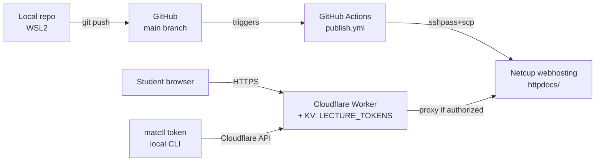
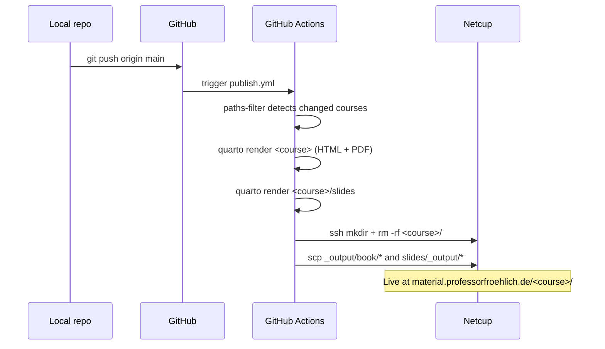
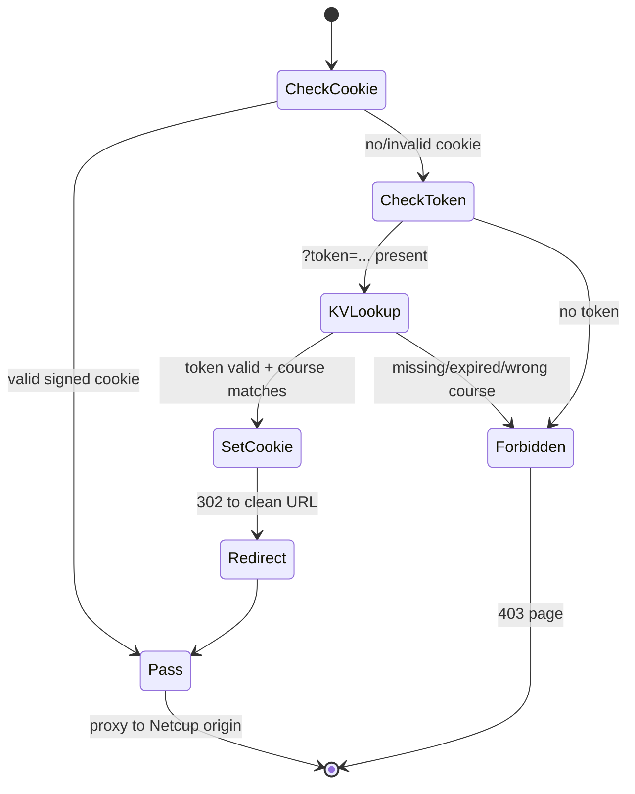

# Administration Manual
# material.professorfroehlich.de

Operations reference for the Vorlesungen publishing pipeline. Authoring
conventions live in [`CLAUDE.md`](../CLAUDE.md); the original build-out is
documented in [`plans/deployment-pipeline.md`](plans/deployment-pipeline.md).

---

## 1. Executive Summary

Lecture scripts and slides for all THD courses live in this monorepo as Quarto
projects. Pushing to `main` triggers GitHub Actions, which renders the changed
courses (HTML book + Typst PDF + RevealJS slides) and deploys them via
`sshpass`+`scp` to Netcup webhosting under
`material.professorfroehlich.de/<course>/`. A Cloudflare Worker sits in front
of the subdomain and gates every request against per-course tokens stored in a
Workers KV namespace. Students receive a tokenised link via iLearn; the Worker
exchanges the token for a year-long signed session cookie on first visit.

---

## 2. Architecture Overview



| System | Role |
|---|---|
| **GitHub repo** | Source of truth: course content, Worker source, workflow, scripts |
| **GitHub Actions** | Detects changed courses (`dorny/paths-filter`), renders Quarto, deploys via SSH |
| **Netcup webhosting** | Static origin for `material.professorfroehlich.de`. No rsync in chroot — `scp` only |
| **Cloudflare DNS + Worker** | Proxies the subdomain, enforces token auth, serves the 403 page |
| **Cloudflare KV (`LECTURE_TOKENS`)** | Per-token records: `{course, label, issued, expires}` |
| **`matctl token`** | Local admin CLI that talks to the Cloudflare API to create/list/revoke tokens |

---

## 3. Data Flow

### 3.1 Publish flow (push → live)



### 3.2 Access flow (student request)



The cookie is `mat_session = <course>.<expiry>.<HMAC-SHA256>` signed with
`COOKIE_SECRET`. Validity: 1 year. A `course="*"` token grants access to all
courses.

---

## 4. Scripts and Settings per System

### GitHub repository

| Item | Location | Purpose |
|---|---|---|
| Workflow | `.github/workflows/publish.yml` | Build + deploy per course |
| New course bootstrap | `new-course.sh` | Scaffolds a course directory |
| Token CLI | `matctl token` | Issue / list / revoke / show tokens |
| Worker source | `cloudflare/worker.js` | Authoritative copy; deploy manually |

**GitHub Actions secrets** (Repo Settings → Secrets and variables → Actions):

| Secret | Used by |
|---|---|
| `SSH_HOST` | Deploy step (Netcup hostname) |
| `SSH_USER` | Deploy step (Netcup SSH user) |
| `SSH_PASSWORD` | Deploy step (`sshpass -e`) |

### Cloudflare

| Item | Where | Notes |
|---|---|---|
| DNS | DNS tab | `material` A record → Netcup IP, **proxied (orange cloud)** |
| Worker | Workers & Pages → `<worker name>` | Source pasted from `cloudflare/worker.js` |
| Worker route | Worker → Triggers | `material.professorfroehlich.de/*` |
| KV namespace | Workers & Pages → KV | `LECTURE_TOKENS` |
| KV binding | Worker → Settings → Variables | `LECTURE_TOKENS` → namespace ID |
| Worker variable | Worker → Settings → Variables | `COOKIE_SECRET` (32-hex, secret) |

**Re-deploying the Worker:** edit `cloudflare/worker.js` locally, commit, then
paste into the Cloudflare dashboard editor and click *Deploy*. There is no
`wrangler.toml` — this is intentional, manual deploys are infrequent.

### Netcup

| Item | Path / setting |
|---|---|
| Subdomain | `material.professorfroehlich.de` (created in CCP → Subdomains) |
| Webroot | `/material.professorfroehlich.de/httpdocs/` |
| Per-course tree | `httpdocs/<course>/` (book HTML, PDF, `slides/`) |
| Access | Same SSH credentials as `pfhome`; `scp` only (no rsync) |

### Local admin machine

| Item | Path |
|---|---|
| Token CLI | `matctl token` |
| Credentials | `scripts/.env` (gitignored) |

---

## 5. Configuration Files

| File | Purpose | Touch when… |
|---|---|---|
| `_brand.yml` | Repo-wide Quarto branding (colors, fonts, logo) | THD CI changes |
| `shared/base.scss` | HTML theme overrides | Visual tweaks across all courses |
| `<course>/_quarto.yml` | Course title, language, PDF `output-file` | Each new course |
| `<course>/slides/_quarto.yml` | Slide footer | Each new course |
| `projects.yml` | Manifest of publishable projects (name + type) | Each new course or doc (see §6) |
| `.github/workflows/publish.yml` | Build + deploy workflow | Tooling changes only — never per-course |
| `material_core/scripts/.env` | `CF_ACCOUNT_ID`, `CF_API_TOKEN`, `CF_KV_NAMESPACE_ID` | Rotating Cloudflare API token (read by `matctl token`) |
| `cloudflare/worker.js` | Auth Worker source | Worker logic changes (then redeploy) |

### 5.1 Manifest: `projects.yml`

Every publishable project — course or standalone document — is enumerated in
`material/projects.yml`. The CI workflow reads it once per run and uses it
for both change detection and matrix expansion.

Schema:

```yaml
projects:
  - name: <directory-name>   # also the URL path segment under material.professorfroehlich.de/
    type: course | doc
```

Render and deploy rules by type:

| `type` | Render | Deploy |
|---|---|---|
| `course` | `quarto render <name>` + `quarto render <name>/slides` | `<name>/_output/book/*` → webroot; `<name>/slides/_output/*` → `<webroot>/slides/` |
| `doc`    | `quarto render <name>` | `<name>/_output/*` → webroot |

Change detection: the workflow diffs the push against its base. A project is
rebuilt only when at least one changed file lives under `<name>/`. Changes to
`projects.yml` or `.github/workflows/publish.yml` rebuild everything, as does
`workflow_dispatch` and any push with no valid base commit (first push, force
push). An unrelated edit (top-level README, docs, etc.) builds nothing — the
`build` matrix is guarded by `if: needs.changes.outputs.projects != '[]'`.

`matctl course add` and `matctl doc add` patch this file automatically.

### 5.2 Project types: course vs. doc

| Type | Structure | Render | Deploy |
|------|-----------|--------|--------|
| `course` | Multi-chapter Quarto book + RevealJS slides sub-project | `quarto render <name>` + `quarto render <name>/slides` | `<name>/_output/book/*` → webroot; `<name>/slides/_output/*` → `<webroot>/slides/` |
| `doc` | Single `index.qmd`, flat `assets/` | `quarto render <name>` only | `<name>/_output/*` → webroot (no `book/` infix) |

Choose **`course`** when the project has multiple chapters, a book-level TOC,
and accompanying slides. Choose **`doc`** for single-file or small flat
publications — technical guides, reference documents, one-off write-ups — that
don't need slides or chapter navigation.

---

## 6. Course Lifecycle

Replace `<course>` with the kebab-case course slug throughout.

### 6.1 Adding a course

Run from inside the `material` checkout:

```bash
matctl course add <course> --title "Human Readable Title"
```

`matctl course add` does three things in order:

1. Copies `material_core/templates/course/` → `./<course>/`, substituting the
   declared `{{COURSE_NAME}}`, `{{COURSE_TITLE}}`, and `{{COURSE_SUBTITLE}}`
   tokens throughout the tree.
2. Appends `{name: <course>, type: course}` to `projects.yml` using
   `ruamel.yaml` in round-trip mode, so any hand-added comments or ordering
   survive. The manifest schema is described in §5.1.
3. Prints next-step hints (preview, commit, push).

No other files need editing — `.github/workflows/publish.yml` reads
`projects.yml` at CI time and fans out a `build` matrix over every registered
project automatically.

Optional flags:

| Flag | Default | Purpose |
|---|---|---|
| `--title "..."` | `<course>` title-cased | Sets the book title and slide footer |
| `--subtitle "..."` | empty | Sets the book subtitle; empty = no subtitle shown |

### 6.2 Removing a course

```bash
matctl course remove <course>          # prompts for confirmation
matctl course remove <course> --yes    # no prompt, for scripting
```

`course remove` removes the manifest entry from `projects.yml` and deletes
`./<course>/` from disk.

**What it does NOT touch** — you must handle these manually:

- Remote content at `material.professorfroehlich.de/<course>/` — delete via
  SSH or let it become a dead link.
- Cloudflare Worker KV tokens issued against the removed course — they become
  dead keys. Revoke them with `matctl token revoke <token>` (§8.3) if you want
  to clean up KV.

### 6.3 First publish after adding a course

```bash
git add <course>/ projects.yml
git commit -m "Add course: <course>"
git push
```

Watch the run under GitHub → Actions. On success the course is live at
`https://material.professorfroehlich.de/<course>/` — but locked behind the
Worker until a token is issued (§8).

---

## 7. Document Lifecycle

Replace `<name>` with the kebab-case document slug throughout.

### 7.1 Adding a document

Run from inside the `material` checkout:

```bash
matctl doc add <name> --title "Human Readable Title"
```

`matctl doc add` does three things in order:

1. Copies `material_core/templates/doc/` → `./<name>/`, substituting the
   declared `{{DOC_NAME}}` and `{{DOC_TITLE}}` tokens throughout the tree.
2. Appends `{name: <name>, type: doc}` to `projects.yml` using `ruamel.yaml`
   in round-trip mode.
3. Prints next-step hints (preview, commit, push).

Optional flags:

| Flag | Default | Purpose |
|---|---|---|
| `--title "..."` | `<name>` title-cased | Sets the document title |

### 7.2 Removing a document

```bash
matctl doc remove <name>          # prompts for confirmation
matctl doc remove <name> --yes    # no prompt, for scripting
```

`doc remove` removes the manifest entry from `projects.yml` and deletes
`./<name>/` from disk. Remote content must be cleaned up manually (same
caveats as §6.2).

### 7.3 First publish after adding a document

```bash
git add <name>/ projects.yml
git commit -m "Add doc: <name>"
git push
```

Watch the run under GitHub → Actions. The `build` matrix resolves
`PROJECT_TYPE=doc`, runs `quarto render <name>` (no slides step), and
deploys `<name>/_output/*` flat to the webroot.

---

## 8. Token Management

All commands read credentials from `material_core/scripts/.env` inside the
package (env vars `CF_ACCOUNT_ID`, `CF_API_TOKEN`, `CF_KV_NAMESPACE_ID`).
Process environment variables take precedence if set.

### 8.1 Issue a token

```bash
matctl token issue <course> "<label>" [--days 365]
```

Examples:

```bash
matctl token issue digital-und-mikrocomputertechnik "WS2025/26" --days 365
matctl token issue "*" "Alle Kurse WS2025/26" --days 365
```

`matctl token issue` prints the token and the ready-to-paste iLearn URL:

```
https://material.professorfroehlich.de/<course>/?token=<TOKEN>
```

Paste that link into the iLearn course. Students who follow it once receive a
1-year session cookie and can bookmark the clean URL.

### 8.2 List tokens

```bash
matctl token list                  # all tokens
matctl token list <course>         # filtered
```

Expired tokens are flagged `[EXPIRED]` but remain in KV until revoked.

### 8.3 Revoke a token

```bash
matctl token revoke <token>
```

Effect is immediate — the next request to the Worker fails the KV lookup. Note
that **already-issued session cookies remain valid until they expire** (up to
1 year), because cookie verification does not consult KV. To force a global
re-auth, rotate `COOKIE_SECRET` in the Worker variables: every existing cookie
becomes invalid on next request.

### 8.4 Show token metadata

```bash
matctl token show <token>
```

Prints the raw JSON stored in KV for one token: `course`, `label`, `issued`,
`expires`.
