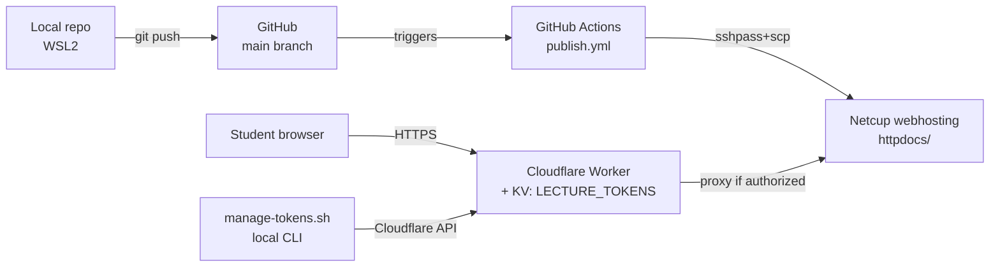
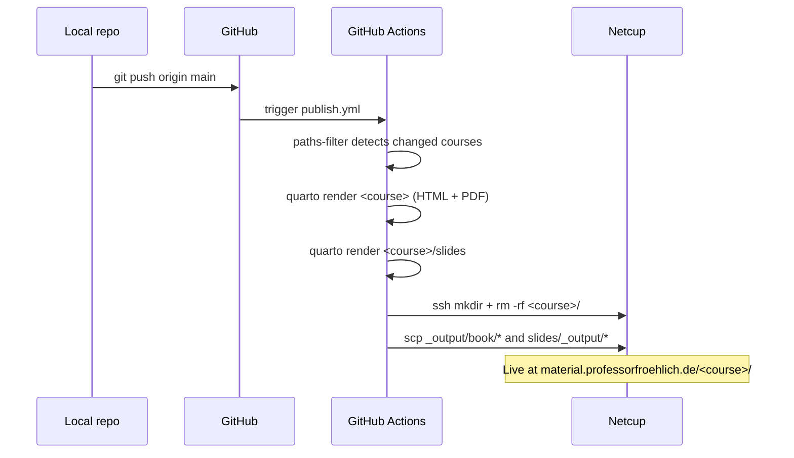
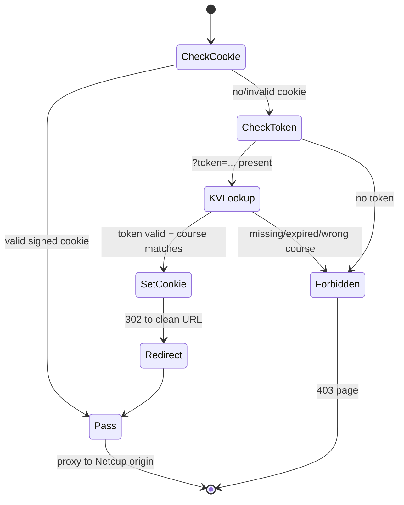

# Administration Manual
# material.professorfroehlich.de

Operations reference for the Vorlesungen publishing pipeline. Authoring
conventions live in [`CLAUDE.md`](../CLAUDE.md); the original build-out is
documented in [`plans/deployment-pipeline.md`](plans/deployment-pipeline.md).

---

## 1. Executive Summary

Lecture scripts and slides for all THD courses live in this monorepo as Quarto
projects. Pushing to `main` triggers GitHub Actions, which renders the changed
courses (HTML book + Typst PDF + RevealJS slides) and deploys them via
`sshpass`+`scp` to Netcup webhosting under
`material.professorfroehlich.de/<course>/`. A Cloudflare Worker sits in front
of the subdomain and gates every request against per-course tokens stored in a
Workers KV namespace. Students receive a tokenised link via iLearn; the Worker
exchanges the token for a year-long signed session cookie on first visit.

---

## 2. Architecture Overview



| System | Role |
|---|---|
| **GitHub repo** | Source of truth: course content, Worker source, workflow, scripts |
| **GitHub Actions** | Detects changed courses (`dorny/paths-filter`), renders Quarto, deploys via SSH |
| **Netcup webhosting** | Static origin for `material.professorfroehlich.de`. No rsync in chroot — `scp` only |
| **Cloudflare DNS + Worker** | Proxies the subdomain, enforces token auth, serves the 403 page |
| **Cloudflare KV (`LECTURE_TOKENS`)** | Per-token records: `{course, label, issued, expires}` |
| **`manage-tokens.sh`** | Local admin CLI that talks to the Cloudflare API to create/list/revoke tokens |

---

## 3. Data Flow

### 3.1 Publish flow (push → live)



### 3.2 Access flow (student request)



The cookie is `mat_session = <course>.<expiry>.<HMAC-SHA256>` signed with
`COOKIE_SECRET`. Validity: 1 year. A `course="*"` token grants access to all
courses.

---

## 4. Scripts and Settings per System

### GitHub repository

| Item | Location | Purpose |
|---|---|---|
| Workflow | `.github/workflows/publish.yml` | Build + deploy per course |
| New course bootstrap | `new-course.sh` | Scaffolds a course directory |
| Token CLI | `scripts/manage-tokens.sh` | Issue / list / revoke / show tokens |
| Worker source | `cloudflare/worker.js` | Authoritative copy; deploy manually |

**GitHub Actions secrets** (Repo Settings → Secrets and variables → Actions):

| Secret | Used by |
|---|---|
| `SSH_HOST` | Deploy step (Netcup hostname) |
| `SSH_USER` | Deploy step (Netcup SSH user) |
| `SSH_PASSWORD` | Deploy step (`sshpass -e`) |

### Cloudflare

| Item | Where | Notes |
|---|---|---|
| DNS | DNS tab | `material` A record → Netcup IP, **proxied (orange cloud)** |
| Worker | Workers & Pages → `<worker name>` | Source pasted from `cloudflare/worker.js` |
| Worker route | Worker → Triggers | `material.professorfroehlich.de/*` |
| KV namespace | Workers & Pages → KV | `LECTURE_TOKENS` |
| KV binding | Worker → Settings → Variables | `LECTURE_TOKENS` → namespace ID |
| Worker variable | Worker → Settings → Variables | `COOKIE_SECRET` (32-hex, secret) |

**Re-deploying the Worker:** edit `cloudflare/worker.js` locally, commit, then
paste into the Cloudflare dashboard editor and click *Deploy*. There is no
`wrangler.toml` — this is intentional, manual deploys are infrequent.

### Netcup

| Item | Path / setting |
|---|---|
| Subdomain | `material.professorfroehlich.de` (created in CCP → Subdomains) |
| Webroot | `/material.professorfroehlich.de/httpdocs/` |
| Per-course tree | `httpdocs/<course>/` (book HTML, PDF, `slides/`) |
| Access | Same SSH credentials as `pfhome`; `scp` only (no rsync) |

### Local admin machine

| Item | Path |
|---|---|
| Token CLI | `scripts/manage-tokens.sh` |
| Credentials | `scripts/.env` (gitignored) |
| Template | `scripts/.env.example` |

---

## 5. Configuration Files

| File | Purpose | Touch when… |
|---|---|---|
| `_brand.yml` | Repo-wide Quarto branding (colors, fonts, logo) | THD CI changes |
| `shared/base.scss` | HTML theme overrides | Visual tweaks across all courses |
| `<course>/_quarto.yml` | Course title, language, PDF `output-file` | Each new course |
| `<course>/slides/_quarto.yml` | Slide footer | Each new course |
| `.github/workflows/publish.yml` | Build + deploy jobs | Each new course (see §6) |
| `scripts/.env` | `CF_ACCOUNT_ID`, `CF_API_TOKEN`, `CF_KV_NAMESPACE_ID` | Rotating Cloudflare API token |
| `cloudflare/worker.js` | Auth Worker source | Worker logic changes (then redeploy) |

---

## 6. Adding a New Course

Replace `<course>` with the kebab-case course slug throughout.

### 6.1 Scaffold the course

```bash
./new-course.sh <course>
```

Then edit:

- `<course>/_quarto.yml` — set `title`, `lang`, and
  `format.orange-book-typst.output-file: <course>.pdf`
- `<course>/slides/_quarto.yml` — set the footer text

### 6.2 Add the workflow job

Edit `.github/workflows/publish.yml` in **two** places.

**(a) `changes` job — add an output and a paths-filter entry:**

```yaml
jobs:
  changes:
    runs-on: ubuntu-latest
    outputs:
      digital-und-mikrocomputertechnik: ${{ steps.filter.outputs.digital-und-mikrocomputertechnik }}
      <course>: ${{ steps.filter.outputs.<course> }}      # ← add
    steps:
      - uses: actions/checkout@v4
      - uses: dorny/paths-filter@v3
        id: filter
        with:
          filters: |
            digital-und-mikrocomputertechnik:
              - 'digital-und-mikrocomputertechnik/**'
              - 'shared/**'
              - '_brand.yml'
            <course>:                                     # ← add
              - '<course>/**'
              - 'shared/**'
              - '_brand.yml'
```

**(b) Course job — copy an existing block and rename:**

```yaml
  <course>:
    needs: changes
    if: needs.changes.outputs['<course>'] == 'true' || github.event_name == 'workflow_dispatch'
    runs-on: ubuntu-latest
    env:
      COURSE_DIR: <course>
    steps:
      - uses: actions/checkout@v4
      - uses: quarto-dev/quarto-actions/setup@v2
      - name: Install fonts
        run: |
          mkdir -p ~/.local/share/fonts
          cp shared/assets/fonts/*.ttf shared/assets/fonts/*.otf ~/.local/share/fonts/ 2>/dev/null || true
          fc-cache -fv
      - name: Render book (HTML + PDF)
        run: quarto render $COURSE_DIR
      - name: Render slides
        run: quarto render $COURSE_DIR/slides
      - name: Deploy to Netcup
        env:
          SSHPASS: ${{ secrets.SSH_PASSWORD }}
        run: |
          sudo apt-get update -qq && sudo apt-get install -y -qq sshpass
          SSH_OPTS="-o StrictHostKeyChecking=no -4"
          REMOTE="${{ secrets.SSH_USER }}@${{ secrets.SSH_HOST }}"
          WEBROOT="/material.professorfroehlich.de/httpdocs/${COURSE_DIR}"
          sshpass -e ssh $SSH_OPTS "$REMOTE" "mkdir -p ${WEBROOT} && rm -rf ${WEBROOT}/* ${WEBROOT}/.[!.]*" 2>/dev/null || true
          sshpass -e scp $SSH_OPTS -r ${COURSE_DIR}/_output/book/* "$REMOTE:${WEBROOT}/"
          if [[ -d "${COURSE_DIR}/slides/_output" ]]; then
            sshpass -e ssh $SSH_OPTS "$REMOTE" "mkdir -p ${WEBROOT}/slides"
            sshpass -e scp $SSH_OPTS -r ${COURSE_DIR}/slides/_output/* "$REMOTE:${WEBROOT}/slides/"
          fi
```

### 6.3 First publish

```bash
git add <course>/ .github/workflows/publish.yml
git commit -m "Add course: <course>"
git push
```

Watch the run under GitHub → Actions. On success the course is live at
`https://material.professorfroehlich.de/<course>/` — but locked behind the
Worker until a token is issued (§7).

---

## 7. Token Management

All commands run from the repo root and read credentials from `scripts/.env`
(see `scripts/.env.example` for the three required Cloudflare variables).

### 7.1 Issue a token

```bash
./scripts/manage-tokens.sh issue <course> "<label>" [days]
# default: 365 days
```

Examples:

```bash
./scripts/manage-tokens.sh issue digital-und-mikrocomputertechnik "WS2025/26" 365
./scripts/manage-tokens.sh issue "*" "Alle Kurse WS2025/26" 365
```

The script prints the token and the ready-to-paste iLearn URL:

```
https://material.professorfroehlich.de/<course>/?token=<TOKEN>
```

Paste that link into the iLearn course. Students who follow it once receive a
1-year session cookie and can bookmark the clean URL.

### 7.2 List tokens

```bash
./scripts/manage-tokens.sh list                  # all tokens
./scripts/manage-tokens.sh list <course>         # filtered
```

Expired tokens are flagged `[EXPIRED]` but remain in KV until revoked.

### 7.3 Revoke a token

```bash
./scripts/manage-tokens.sh revoke <token>
```

Effect is immediate — the next request to the Worker fails the KV lookup. Note
that **already-issued session cookies remain valid until they expire** (up to
1 year), because cookie verification does not consult KV. To force a global
re-auth, rotate `COOKIE_SECRET` in the Worker variables: every existing cookie
becomes invalid on next request.
